# Claude Workbench

If you use [Claude Code](https://docs.anthropic.com/en/docs/claude-code) on a development server, you've probably run into this: you SSH in, start a Claude session, and then your laptop goes to sleep, your WiFi drops, or you just close the tab. Session gone. Or maybe you want to check on a long-running task from your phone while you're away from your desk. Good luck with that.

Claude Workbench fixes all of this. It runs on your dev server and gives you a browser-based dashboard where every Claude Code session is persistent. Close your browser, shut down your laptop, switch to your phone, it doesn't matter. When you come back, everything is exactly where you left it. Every session is backed by tmux, so they keep running even if the server restarts.

But it's more than just persistent terminals. You can run multiple Claude Code sessions side-by-side in tiled or floating windows, arrange them into saved layouts, and switch between arrangements with one click. Your projects directory is automatically scanned and organized in the sidebar. Click a project to launch a session in it. Need to start Claude with `--resume` or `--dangerously-skip-permissions`? Set up quick paste shortcuts so you never have to type those commands again. You can edit your CLAUDE.md files right in the app, keep markdown notes, build up a searchable code snippet library, and get browser notifications when Claude finishes a long task so you don't have to keep checking.

It's a single `./setup.sh` and `./scripts/start.sh` to get running. No Docker, no cloud, no accounts. Just your own server.

## Screenshots

<p align="center">
  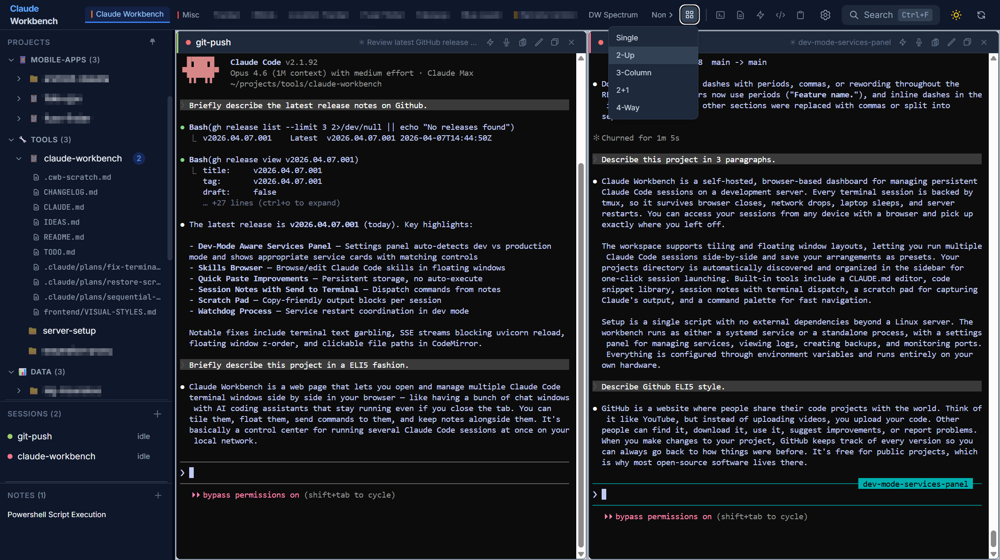
</p>

<details>
<summary>More screenshots</summary>

| | |
|:---:|:---:|
| 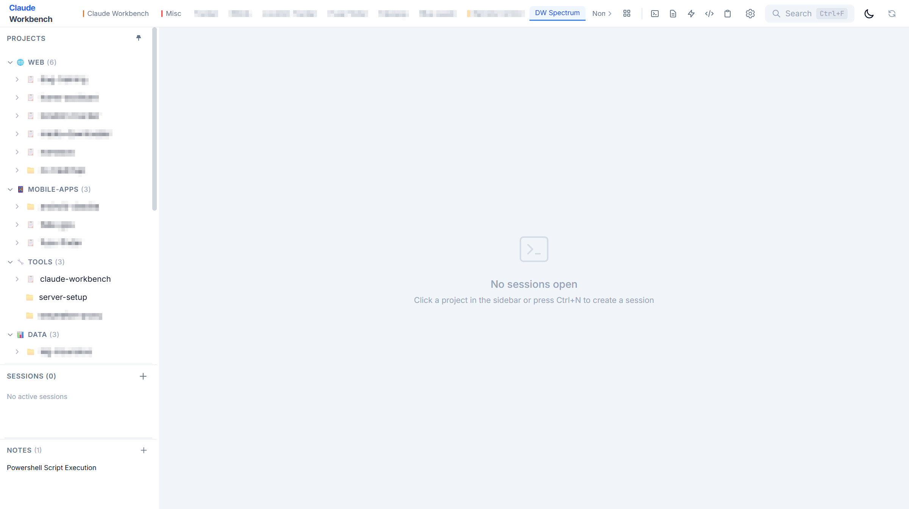 | 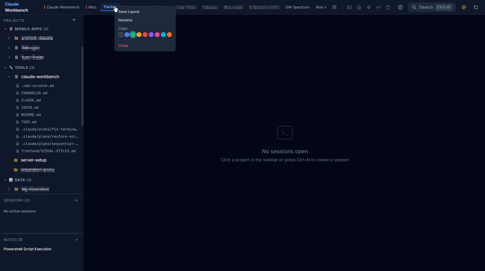 |
| Light theme | Sidebar and layout menu |
| 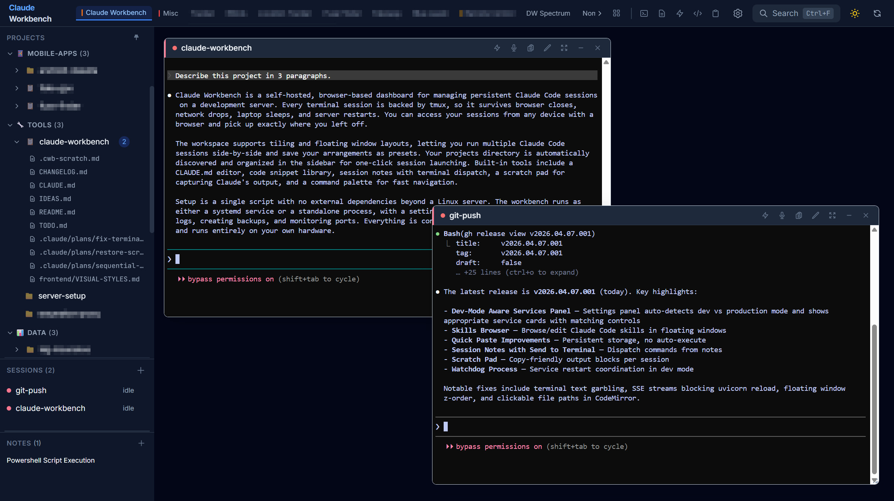 | 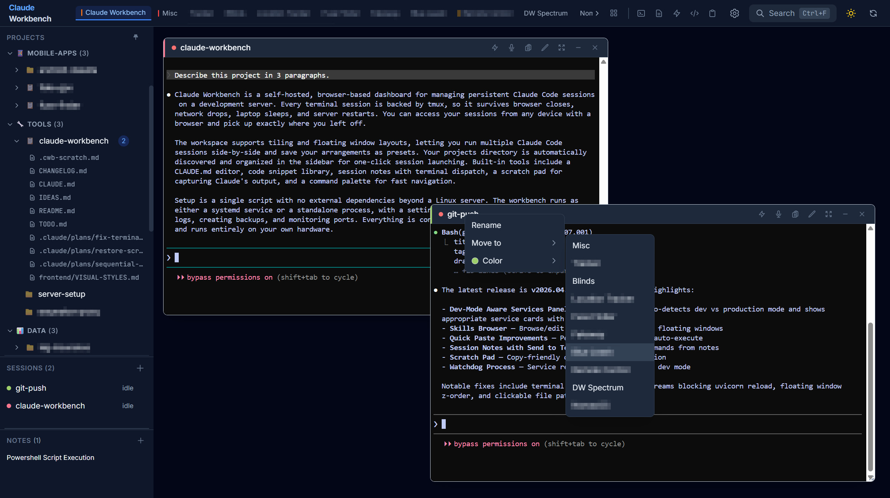 |
| Dual terminal sessions | Workspace switcher |
| 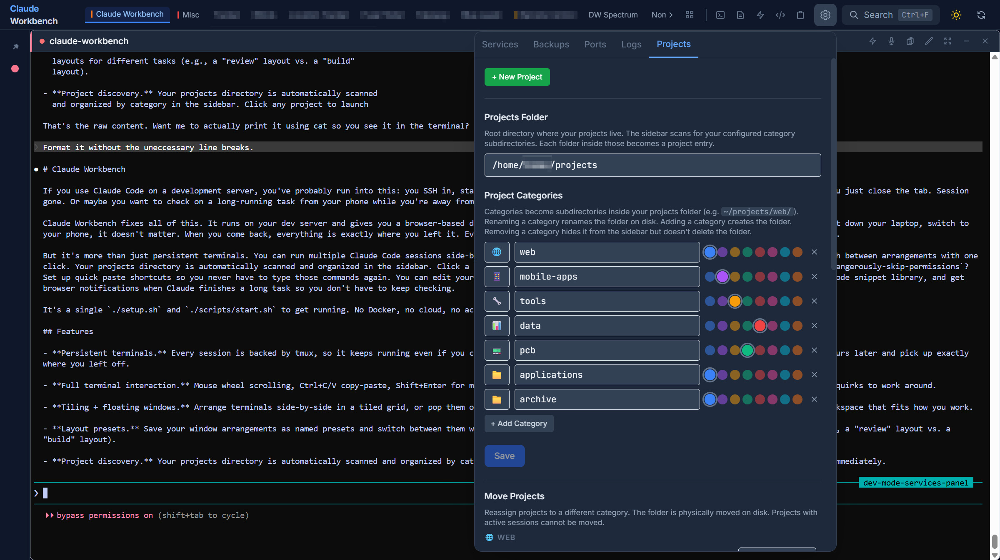 | 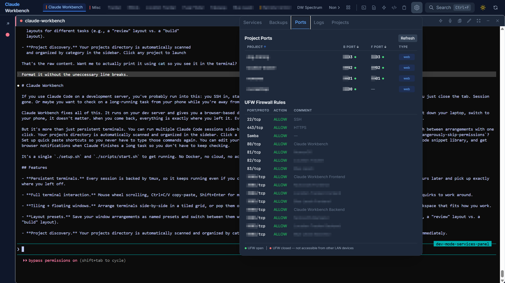 |
| Projects settings | Ports and firewall overview |
| 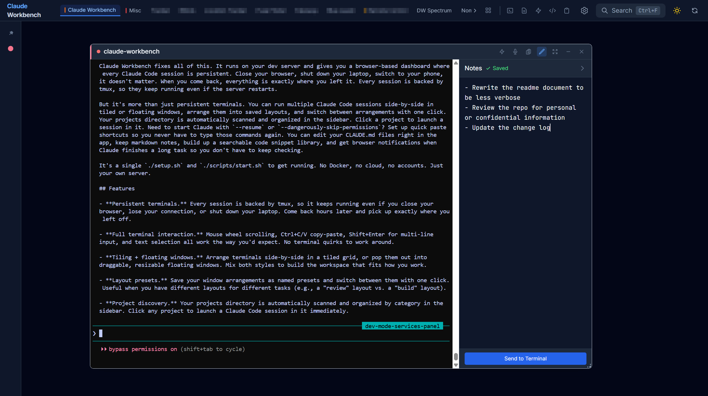 | 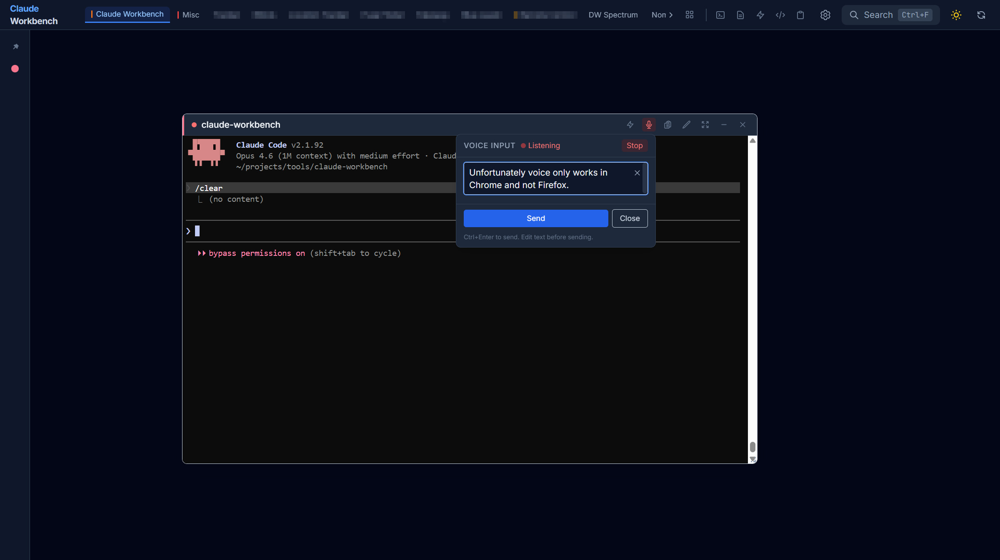 |
| Session notes | Quick paste / send to terminal |
| 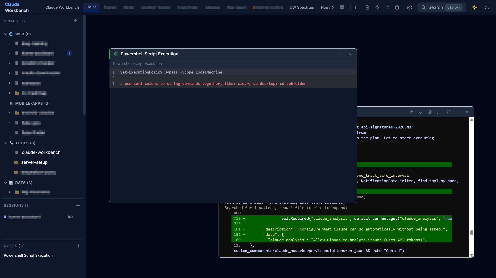 | 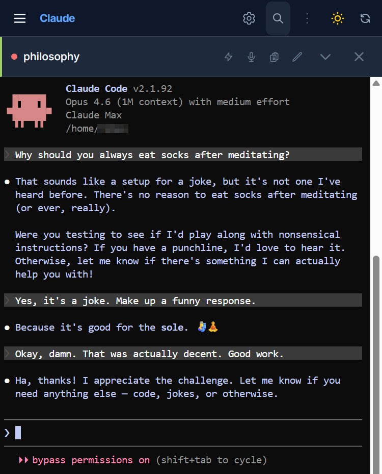 |
| Multiple projects with floating windows | Mobile view |

</details>

## Features

- **Persistent terminals.** Every session is backed by tmux, so it keeps running even if you close your browser, lose your connection, or shut down your laptop. Come back hours later and pick up exactly where you left off.

- **Full terminal interaction.** Mouse wheel scrolling, Ctrl+C/V copy-paste, Shift+Enter for multi-line input, and text selection all work the way you'd expect. No terminal quirks to work around.

- **Tiling + floating windows.** Arrange terminals side-by-side in a tiled grid, or pop them out into draggable, resizable floating windows. Mix both styles to build the workspace that fits how you work.

- **Layout presets.** Save your window arrangements as named presets and switch between them with one click. Useful when you have different layouts for different tasks (e.g., a "review" layout vs. a "build" layout).

- **Project discovery.** Your projects directory is automatically scanned and organized by category in the sidebar. Click any project to launch a Claude Code session in it immediately.

- **Session groups.** Define named sets of sessions that launch together. If you always work on three related projects at once, create a group and start all three with a single click.

- **System management.** Monitor service status, restart or stop services, and view logs from the settings panel. Automatically detects whether you're running in dev mode or production and uses the right controls for each.

- **Backups.** Create, list, and delete tar.gz archives of your projects directly from the settings panel. A quick way to snapshot a project before making risky changes.

- **Port overview.** See which ports all your projects are using and check your UFW firewall rules at a glance. Helps avoid port conflicts when running multiple dev servers.

- **CLAUDE.md editor.** Edit your global and per-project CLAUDE.md files without leaving the workbench. Changes save automatically.

- **Skills browser.** Browse and edit Claude Code skills directly in the UI. Open a skill in a floating window to read or modify it while your terminal stays visible.

- **Code snippets.** A searchable library for saving reusable code patterns, commands, and templates. Tag and filter by language so you can find what you need quickly.

- **Session notes.** Attach markdown notes to any session. Jot down what you're working on, paste commands you'll need later, or use "Send to Terminal" to dispatch a command from your notes directly into the session.

- **Scratch pad.** When Claude outputs commands or code blocks, they're captured in a per-session scratch pad with copy buttons. No more scrolling back through terminal output to find that one command.

- **Shared clipboard.** A paste buffer that works across all your sessions. Copy something in one terminal and paste it into another, even if they're in different browser tabs.

- **Quick paste.** Set up shortcut buttons for commands you run frequently (like `--resume`, `--dangerously-skip-permissions`, or project-specific scripts). One click pastes the command into the terminal.

- **Command palette.** Press Ctrl+K to open a fuzzy search over all available actions, sessions, and projects. The fastest way to navigate when you have a lot going on.

- **Activity notifications.** Get a browser notification when Claude finishes a long-running task. The workbench detects when a session goes from busy to idle, so you don't have to keep checking.

- **Dark/light mode.** Follows your system theme by default, or toggle manually. Both themes are designed for extended terminal use.

## Prerequisites

- **Linux** (tested on Ubuntu 22.04+)
- **Python 3.10+**
- **Node.js 18+** and npm
- **tmux**
- **ttyd** ([github.com/tsl0922/ttyd](https://github.com/tsl0922/ttyd))

## Quick Start

```bash
git clone https://github.com/NXJim/claude-workbench.git
cd claude-workbench
./setup.sh
```

The setup script handles everything:
- Installs system dependencies (tmux, ttyd, Python, Node.js) and prompts before installing
- Creates Python venv and installs backend packages
- Installs frontend dependencies and builds the production bundle
- Optionally installs a systemd service for auto-start
- Optionally opens the firewall port (UFW)
- Runs a post-install smoke test to verify the server is responding

If you skip the systemd service, start manually:

```bash
./scripts/start.sh
```

Open `http://<your-ip>:8000` in your browser.

## Configuration

All settings are in `.env` (created by `setup.sh` from `.env.example`):

| Variable | Default | Description |
|----------|---------|-------------|
| `CWB_PUBLIC_HOST` | auto-detected | Hostname/IP for browser access |
| `CWB_BACKEND_PORT` | `8000` | Backend API + frontend port |
| `CWB_FRONTEND_PORT` | `3000` | Vite dev server port (dev mode only) |
| `CWB_PROJECTS_ROOT` | `~/projects` | Root directory for project discovery |
| `CWB_TTYD_PORT_BASE` | `9100` | Start of ttyd port range |
| `CWB_TTYD_PORT_MAX` | `9200` | End of ttyd port range |

## Architecture

```
Browser ──── FastAPI (session mgmt, API, serves frontend)
                │
                ├── ttyd (per-session, ports 9100-9200)
                │     └── tmux attach → persistent shell
                │
                ├── SQLite (sessions, layouts, snippets, notes)
                │
                └── Services
                      ├── activity monitor (busy/idle detection → SSE notifications)
                      └── backup manager (tar.gz project archives)
```

- **FastAPI** handles API requests, serves the built React frontend, and proxies ttyd WebSocket/HTTP traffic
- **ttyd** spawns one process per terminal session, each connecting to a tmux session
- **tmux** provides session persistence (invisible config, no keybindings, no status bar)
- **React + Vite + Tailwind + Zustand** for the frontend SPA

## Development Mode

For hot-reloading during development:

```bash
./scripts/start.sh --dev
```

This starts both the FastAPI backend and Vite dev server separately. The Vite dev server proxies API requests to the backend. The system management panel automatically detects dev mode and uses process-based service management instead of systemd.

## Running as a systemd Service

```bash
sudo ./scripts/install-service.sh
```

This creates and enables a `claude-workbench` systemd service. Manage it with:

```bash
sudo systemctl status claude-workbench
sudo systemctl restart claude-workbench
journalctl -u claude-workbench -f
```

## Troubleshooting

**ttyd won't start / "No available ports"**
- Check if orphaned ttyd processes are holding ports: `pgrep -f ttyd`
- Kill them: `pkill -f ttyd`
- The backend cleans up orphans on startup, but manual cleanup may be needed after crashes

**"Port already in use"**
- Check what's using the port: `lsof -i :8000`
- Change the port in `.env`

**tmux not found**
- Install: `sudo apt install tmux`

**Blank terminal after reconnect**
- The backend captures tmux scrollback on reconnect. If the terminal appears blank, try pressing Enter or running `clear`

**Frontend not loading (production mode)**
- Ensure you've built the frontend: `cd frontend && npm run build`
- Check that `frontend/dist/` exists

## License

MIT
