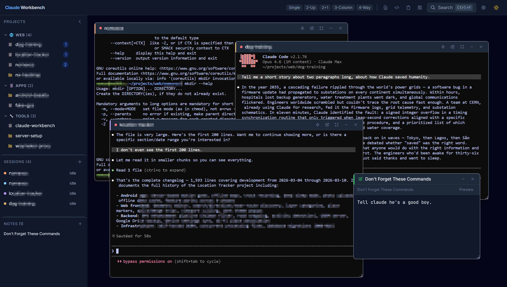
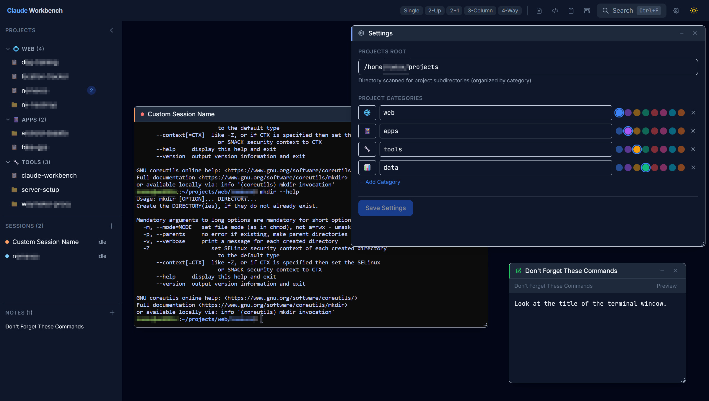
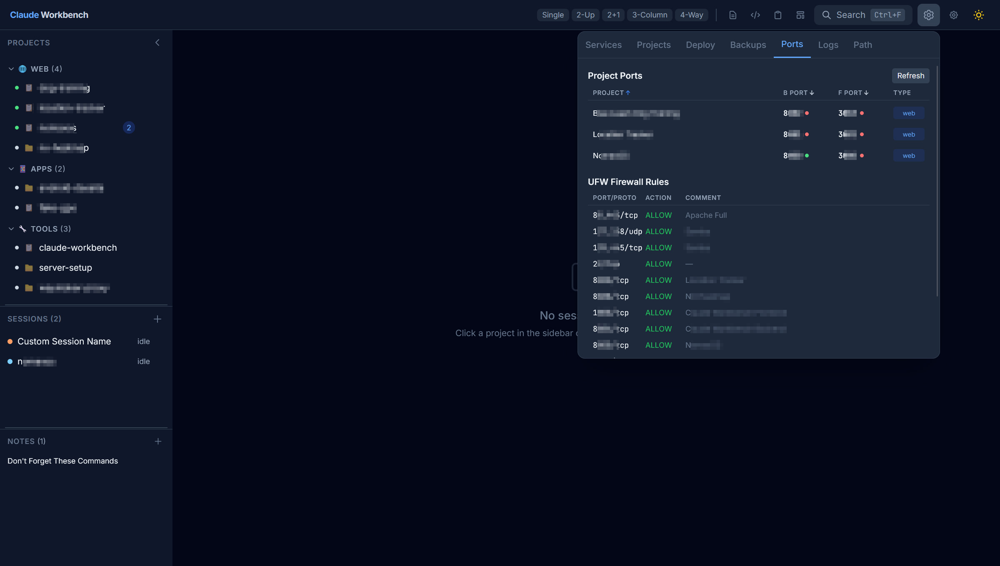

# Claude Workbench

If you use [Claude Code](https://docs.anthropic.com/en/docs/claude-code) on a development server, you've probably run into this: you SSH in, start a Claude session, and then your laptop goes to sleep, your WiFi drops, or you just close the tab. Session gone. Or maybe you want to check on a long-running task from your phone while you're away from your desk. Good luck with that.

Claude Workbench fixes all of this. It runs on your dev server and gives you a browser-based dashboard where every Claude Code session is persistent. Close your browser, shut down your laptop, switch to your phone — it doesn't matter. When you come back, everything is exactly where you left it. Every session is backed by tmux, so they keep running even if the server restarts.

But it's more than just persistent terminals. You can run multiple Claude Code sessions side-by-side in tiled or floating windows, arrange them into saved layouts, and switch between arrangements with one click. Your projects directory is automatically scanned and organized in the sidebar — click a project to launch a session in it. Need to start Claude with `--resume` or `--dangerously-skip-permissions`? Set up quick paste shortcuts so you never have to type those commands again. You can edit your CLAUDE.md files right in the app, keep markdown notes, build up a searchable code snippet library, and get browser notifications when Claude finishes a long task so you don't have to keep checking.

It's a single `./setup.sh` and `./scripts/start.sh` to get running. No Docker, no cloud, no accounts — just your own server.







## Features

- **Persistent terminals** — each session backed by tmux, survives disconnects
- **Full terminal interaction** — mouse wheel scrolling, Ctrl+C/V copy-paste, and Shift+Enter all work as expected
- **Tiling + floating windows** — react-mosaic tiling with draggable floating overlays
- **Layout presets** — save and switch between window arrangements
- **Project discovery** — auto-scans your projects directory, one-click session launch
- **Session groups** — batch launch/close named session configurations
- **CLAUDE.md editor** — edit global and per-project CLAUDE.md files in-app
- **Code snippets** — searchable knowledge base for reusable code patterns
- **Notes** — markdown notes (global and per-project scope)
- **Shared clipboard** — cross-session paste buffer
- **Project dashboard** — grid view of all projects with git status
- **Command palette** — Ctrl+K fuzzy search over all actions
- **Quick paste** — configurable command shortcuts per terminal
- **Activity notifications** — browser alerts when Claude finishes (busy→idle detection)
- **Dark/light mode** — system-aware theme toggle

## Prerequisites

- **Linux** (tested on Ubuntu 22.04+)
- **Python 3.10+**
- **Node.js 18+** and npm
- **tmux**
- **ttyd** — [github.com/tsl0922/ttyd](https://github.com/tsl0922/ttyd)

## Quick Start

```bash
git clone https://github.com/NXJim/claude-workbench.git
cd claude-workbench
./setup.sh
./scripts/start.sh
```

Open `http://<your-ip>:8084` in your browser.

## Configuration

All settings are in `.env` (created by `setup.sh` from `.env.example`):

| Variable | Default | Description |
|----------|---------|-------------|
| `CWB_PUBLIC_HOST` | auto-detected | Hostname/IP for browser access |
| `CWB_BACKEND_PORT` | `8084` | Backend API + frontend port |
| `CWB_FRONTEND_PORT` | `5173` | Vite dev server port (dev mode only) |
| `CWB_PROJECTS_ROOT` | `~/projects` | Root directory for project discovery |
| `CWB_TTYD_PORT_BASE` | `9100` | Start of ttyd port range |
| `CWB_TTYD_PORT_MAX` | `9200` | End of ttyd port range |

## Architecture

```
Browser ──── FastAPI (session mgmt, API, serves frontend)
                │
                ├── ttyd (per-session, ports 9100-9200)
                │     └── tmux attach → persistent shell
                │
                └── SQLite (sessions, layouts, snippets, notes)
```

- **FastAPI** handles API requests, serves the built React frontend, and proxies ttyd WebSocket/HTTP traffic
- **ttyd** spawns one process per terminal session, each connecting to a tmux session
- **tmux** provides session persistence (invisible config — no keybindings, no status bar)
- **React + Vite + Tailwind + Zustand** for the frontend SPA

## Development Mode

For hot-reloading during development:

```bash
./scripts/start.sh --dev
```

This starts both the FastAPI backend and Vite dev server separately. The Vite dev server proxies API requests to the backend.

## Running as a systemd Service

```bash
sudo ./scripts/install-service.sh
```

This creates and enables a `claude-workbench` systemd service. Manage it with:

```bash
sudo systemctl status claude-workbench
sudo systemctl restart claude-workbench
journalctl -u claude-workbench -f
```

## Troubleshooting

**ttyd won't start / "No available ports"**
- Check if orphaned ttyd processes are holding ports: `pgrep -f ttyd`
- Kill them: `pkill -f ttyd`
- The backend cleans up orphans on startup, but manual cleanup may be needed after crashes

**"Port already in use"**
- Check what's using the port: `lsof -i :8084`
- Change the port in `.env`

**tmux not found**
- Install: `sudo apt install tmux`

**Blank terminal after reconnect**
- The backend captures tmux scrollback on reconnect. If the terminal appears blank, try pressing Enter or running `clear`

**Frontend not loading (production mode)**
- Ensure you've built the frontend: `cd frontend && npm run build`
- Check that `frontend/dist/` exists

## License

MIT
